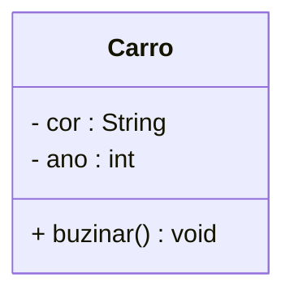

# Programação Orientada a Objetos

## 📚 Sumário
- [Aula 01 – Paradigmas, POO, Objetos e Memória](#aula-01--paradigmas-poo-classes-objetos-e-memória)
- [Aula 06 – Diagrama de Objeto UML, Escopo de Variáveis, Encapsulamento](#aula-06--diagrama-de-objeto-uml-escopo-de-variáveis-encapsulamento)

#### Aula 01 – Paradigmas, POO, Classes, Objetos e Memória
30/07/2025

### Paradigmas de Programação

A programação pode ser abordada de diferentes formas, chamadas **paradigmas**. Os mais conhecidos são:

- **Imperativo**: foco em comandos sequenciais (ex: C)
- **Funcional**: foco em funções puras e imutabilidade (ex: Haskell)
- **Orientado a Objetos (POO)**: foco em objetos que representam entidades do mundo real (ex: Java, Python, C#)

#### Por que usar POO?

A POO é um paradigma muito utilizado no desenvolvimento de sistemas grandes e complexos, pois aproxima o modelo do sistema da forma como pensamos o mundo real.

---

### Vantagens da Programação Orientada a Objetos

✅ Reutilização de código (herança)  
✅ Melhor organização e modularização  
✅ Facilidade de manutenção e extensão  
✅ Ocultamento de detalhes internos (encapsulamento)  
✅ Favorece o trabalho em equipe  

#### Desvantagens

❌ Curva de aprendizado mais acentuada  
❌ Sobrecarga de estrutura para problemas simples  
❌ Exige mais planejamento e abstração inicial  

---

### Classes e Objetos

- **Classe**: um modelo ou estrutura que define os atributos e comportamentos de um tipo de objeto.  

- **Objeto**: uma instância concreta da classe, com seus próprios valores nos atributos.

```java
public class Carro {
    String cor;
    int ano;

    void buzinar() {
        System.out.println("Biiiii!");
    }
}
```
### Atributos e Operações

**Atributos** são as características (variáveis) de um objeto.

**Operações** (ou métodos) são as ações que ele pode realizar.

No exemplo anterior:

`cor` e `ano` são atributos.

`buzinar()` é uma operação.

---

### Diagrama de Classe UML

UML (Unified Modeling Language) é uma linguagem padrão para modelar sistemas orientados a objetos.

Exemplo de diagrama de classe:


---

## Declarando e Criando Objetos em Java

```java
// Declaração
Carro meuCarro;

// Instanciação
meuCarro = new Carro();

// Acesso aos atributos e métodos
meuCarro.cor = "Azul";
meuCarro.buzinar();

// Declaração e instanciação podem ser feitos em uma única linha
Carro meuCarro2 = new Carro();
```

## Memória na JVM: Stack e Heap
#### Stack (Pilha)
Armazena variáveis locais e chamadas de métodos.

Gerenciada pela própria execução dos métodos.

Rápida, mas limitada.

#### Heap (Monte)
Armazena objetos criados com new.

Gerenciada pelo Garbage Collector.

Mais lenta, porém com mais espaço.

Exemplo:

```java
Carro carro = new Carro();
```
A variável `carro` (referência) fica na `stack`

O objeto `new Carro()` vai para a `heap`

#### Aula 06 – Diagrama de Objeto UML, Escopo de Variáveis, Encapsulamento
20/08/2025

## 🆕 Diagrama de Objeto UML

O **Diagrama de Objeto** é uma representação estática de um sistema em um determinado momento, mostrando **instâncias concretas** de classes e seus valores nos atributos.  
Enquanto o **Diagrama de Classe** mostra o modelo genérico, o **Diagrama de Objeto** mostra exemplos reais.

**Exemplo:**

Se temos a classe:

```java
public class Carro {
    String cor;
    int ano;
}
```

E criamos um objeto:

```java
Carro meuCarro = new Carro();
meuCarro.cor = "Vermelho";
meuCarro.ano = 2020;
```

O **Diagrama de Objeto** poderia ser representado assim:

```mermaid
classDiagram
  class "meuCarro : Carro" {
    cor = "Vermelho"
    ano = 2020
  }
```

📌 **Resumo:**  
- **Diagrama de Classe** → modelo (estrutura).  
- **Diagrama de Objeto** → exemplo real (estado atual de um objeto).  

---

## 🆕 Escopo de Variáveis em Java

O **escopo** determina **onde** uma variável pode ser acessada no código.

### Tipos de Escopo:

1. **Variáveis Locais**
   - Declaradas dentro de um método, construtor.
   - Só existem enquanto o método está em execução.
   ```java
   void exemplo() {
       int x = 10; // variável local
       System.out.println(x);
   }
   ```

2. **Variáveis de Instância (Atributos)**
   - Declaradas dentro da classe, mas fora dos métodos.
   - Cada objeto tem sua **própria cópia**.
   ```java
   public class Carro {
       String cor; // variável de instância
   }
   ```

3. **Variáveis de Bloco**
   - Declaradas dentro de um boco.
   - Só o bloco possui acesso.
    ```java
    void exemplo() {
        int x = 10; // variável local
        System.out.println(x);
        do{
            int y = 20; // variável de bloco
            System.out.println(y);
        }while(true);
    }
    ```

📌 **Resumo:**  
- **Local** → vida curta, só no método.  
- **Instância** → ligada a cada objeto.  
- **Bloco** → vida curta, só no bloco.

---

## 🆕 Encapsulamento

O **encapsulamento** é o princípio de **ocultar os detalhes internos** de um objeto e **controlar o acesso** aos seus atributos e métodos.

- Evita acesso direto e indevido aos dados.
- Garante mais segurança e flexibilidade.
- É implementado em Java com **modificadores de acesso** e **métodos getters/setters**.

**Exemplo:**

```java
public class ContaBancaria {
    private double saldo; // atributo privado

    public double getSaldo() { // getter
        return saldo;
    }

    public void depositar(double valor) { // método controlado
        if (valor > 0) {
            saldo += valor;
        }
    }
}
```

📌 **Resumo:**  
- **private** → acesso restrito à própria classe.  
- **public** → acesso liberado para todos.  
- **protected** → acesso para classes do mesmo pacote ou herdeiras.  
- **default** (sem modificador) → acesso apenas dentro do mesmo pacote.
