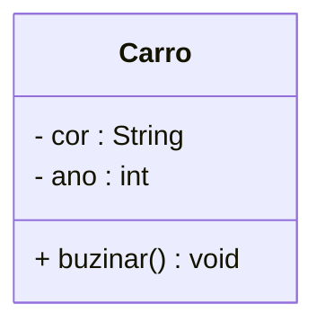

# Programação Orientada a Objetos

## 📚 Sumário
- [Aula 01 – Paradigmas, POO, Objetos e Memória](#aula-01--paradigmas-poo-classes-objetos-e-memória)

#### Aula 01 – Paradigmas, POO, Classes, Objetos e Memória
30/07/2025

### Paradigmas de Programação

A programação pode ser abordada de diferentes formas, chamadas **paradigmas**. Os mais conhecidos são:

- **Imperativo**: foco em comandos sequenciais (ex: C)
- **Funcional**: foco em funções puras e imutabilidade (ex: Haskell)
- **Orientado a Objetos (POO)**: foco em objetos que representam entidades do mundo real (ex: Java, Python, C#)

#### Por que usar POO?

A POO é um paradigma muito utilizado no desenvolvimento de sistemas grandes e complexos, pois aproxima o modelo do sistema da forma como pensamos o mundo real.

---

### Vantagens da Programação Orientada a Objetos

✅ Reutilização de código (herança)  
✅ Melhor organização e modularização  
✅ Facilidade de manutenção e extensão  
✅ Ocultamento de detalhes internos (encapsulamento)  
✅ Favorece o trabalho em equipe  

#### Desvantagens

❌ Curva de aprendizado mais acentuada  
❌ Sobrecarga de estrutura para problemas simples  
❌ Exige mais planejamento e abstração inicial  

---

### Classes e Objetos

- **Classe**: um modelo ou estrutura que define os atributos e comportamentos de um tipo de objeto.  

- **Objeto**: uma instância concreta da classe, com seus próprios valores nos atributos.

```java
public class Carro {
    String cor;
    int ano;

    void buzinar() {
        System.out.println("Biiiii!");
    }
}
```
### Atributos e Operações

**Atributos** são as características (variáveis) de um objeto.

**Operações** (ou métodos) são as ações que ele pode realizar.

No exemplo anterior:

`cor` e `ano` são atributos.

`buzinar()` é uma operação.

---

### Diagrama de Classe UML

UML (Unified Modeling Language) é uma linguagem padrão para modelar sistemas orientados a objetos.

Exemplo de diagrama de classe:


---

## Declarando e Criando Objetos em Java

```java
// Declaração
Carro meuCarro;

// Instanciação
meuCarro = new Carro();

// Acesso aos atributos e métodos
meuCarro.cor = "Azul";
meuCarro.buzinar();

// Declaração e instanciação podem ser feitos em uma única linha
Carro meuCarro2 = new Carro();
```

## Memória na JVM: Stack e Heap
#### Stack (Pilha)
Armazena variáveis locais e chamadas de métodos.

Gerenciada pela própria execução dos métodos.

Rápida, mas limitada.

#### Heap (Monte)
Armazena objetos criados com new.

Gerenciada pelo Garbage Collector.

Mais lenta, porém com mais espaço.

Exemplo:

```java
Carro carro = new Carro();
```
A variável `carro` (referência) fica na `stack`

O objeto `new Carro()` vai para a `heap`