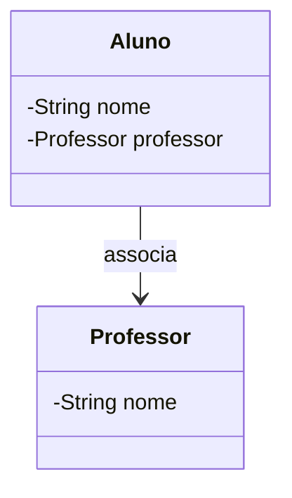
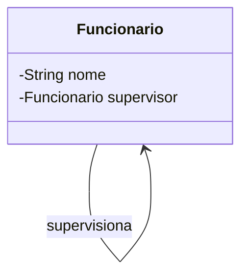
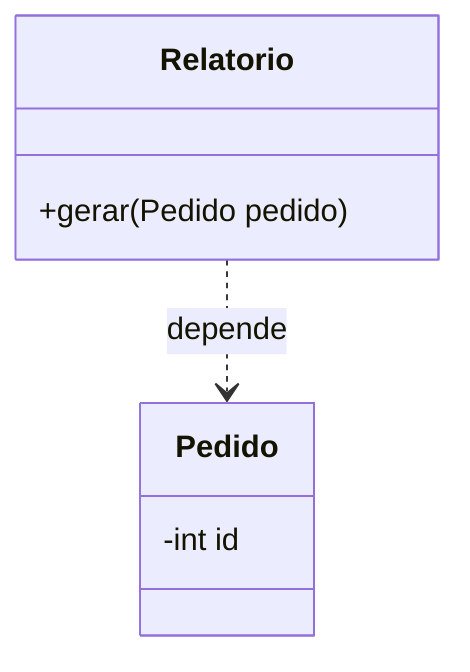
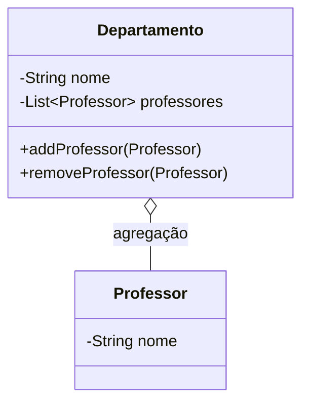
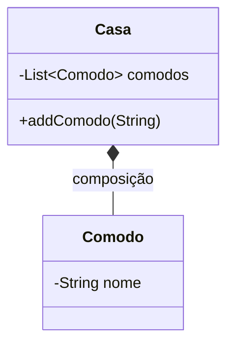
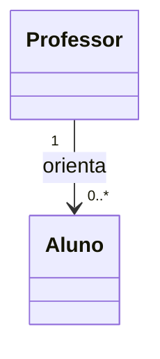
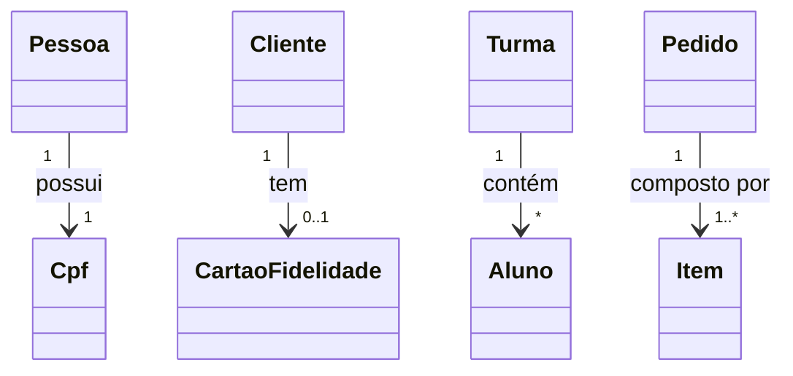

## Unidade 2 – Relacionamentos (Associação, Dependência, Agregação e Composição), Mapeamentos, ArrayList

#### Aula 09 – Relacionamentos, Mapeamentos, ArrayList
30/07/2025

### Relacionamentos entre Classes
Na POO, raramente existem classes isoladas — elas se relacionam para formar sistemas mais complexos.

**Tipos comuns de relacionamento:**
- **Associação** → Uma classe conhece a outra e pode interagir com ela.  
- **Dependência** → Uma classe usa outra temporariamente para executar uma tarefa.
- **Agregação** → Uma classe é composta por outras, mas as partes podem existir separadamente.  
- **Composição** → Uma classe é composta por outras, mas as partes não existem sem o todo.  

### 1. Associação

A associação representa um vínculo lógico entre duas classes, onde uma sabe da existência da outra.
Pode ter multiplicidade (um-para-um, um-para-muitos, muitos-para-muitos).

Exemplo de código:
```java
class Aluno {
private String nome;
private Professor professor; // associação

    public Aluno(String nome, Professor professor) {
        this.nome = nome;
        this.professor = professor;
    }
}

class Professor {
private String nome;

    public Professor(String nome) {
        this.nome = nome;
    }
}
```


### 2. Associação Reflexiva

Quando uma classe se associa a si mesma.
Exemplo clássico: Funcionário que supervisiona outro funcionário.

Exemplo de código:
```java
class Funcionario {
    private String nome;
    private Funcionario supervisor; // associação reflexiva

    public Funcionario(String nome) {
        this.nome = nome;
    }

    public void setSupervisor(Funcionario supervisor) {
        this.supervisor = supervisor;
    }
}
```

### 3. Dependência

A dependência é um relacionamento mais fraco: uma classe usa outra apenas como parâmetro ou variável temporária em métodos.

Exemplo de código:
```java
class Relatorio {
    public void gerar(Pedido pedido) { // depende de Pedido
        System.out.println("Gerando relatório do pedido " + pedido.getId());
    }
}

class Pedido {
    private int id;
    public Pedido(int id) { this.id = id; }
    public int getId() { return id; }
}
```

### 4. Agregação

A agregação é uma associação especial que indica relação Todo/Parte, mas onde as partes podem existir independentemente do todo.

Exemplo de código:
```java
import java.util.ArrayList;
import java.util.List;

class Departamento {
    private String nome;
    private List<Professor> professores = new ArrayList<>();

    public Departamento(String nome) {
        this.nome = nome;
    }

    public void addProfessor(Professor professor) {
        professores.add(professor);
    }

    public void removeProfessor(Professor professor) {
        professores.remove(professor);
    }
}

class Professor {
    private String nome;
    public Professor(String nome) { this.nome = nome; }
}
```

🔹 Observação: O "todo" (Departamento) agrega professores, mas os professores existem mesmo sem o departamento.

### 5. Composição

A composição também é uma relação Todo/Parte, mas nesse caso a parte não pode existir sem o todo.

Exemplo de código:
```java
import java.util.ArrayList;
import java.util.List;

class Casa {
    private List<Comodo> comodos = new ArrayList<>();

    public void addComodo(String nome) {
        comodos.add(new Comodo(nome)); // composição: criado dentro da Casa
    }

    class Comodo { // classe interna representando parte
        private String nome;
        public Comodo(String nome) { this.nome = nome; }
    }
}
```

---

### 💡 Dica: Sempre que modelar um sistema, pergunte "essa classe precisa conhecer a outra?" e "essa relação é temporária ou permanente?" para escolher o tipo de relacionamento correto.

---

### 6. Mapeamentos - Adornos ou Aprimoramentos nos Diagramas UML
Mapeamento é a forma de representar relacionamentos no código e/ou em diagramas UML.

**Nome:** nomear a associação ajuda na leitura (ex: "supervisiona").

**Papel:** define o papel de cada classe no relacionamento. (nome do atributo)

**Multiplicidade:** indica quantos objetos podem se associar (1, 0..1, *, 1..*).

**Navegabilidade:**  seta (→) mostra quem "conhece" quem.
    
    No UML:
    - Linha simples → Associação
    - Linha com losango vazio → Agregação
    - Linha com losango preenchido → Composição

    No código Java:
    - Associação: atributo de outra classe.
    - Agregação/Composição: atributos de coleção ou instâncias diretas.


📌 Lê-se: um professor orienta muitos alunos, mas um aluno tem apenas um professor.

### 7. ArrayList

ArrayList é uma implementação de lista dinâmica em Java, que cresce e diminui conforme necessário.

Características:

Permite elementos duplicados.

Mantém a ordem de inserção.

Acesso rápido por índice.

Exemplo:
```java
import java.util.ArrayList;

public class ExemploArrayList {
    public static void main(String[] args) {
        ArrayList<String> nomes = new ArrayList<>();
        nomes.add("Ana");
        nomes.add("Bruno");
        nomes.add("Carla");

        for (String nome : nomes) {
            System.out.println(nome);
        }
    }
}
```
📌 Resumo: Use ArrayList quando precisar de uma coleção flexível e ordenada.

### 8. Métodos Assessores e Manipulação de Listas

Para atributos simples: usar getters e setters.

Para coleções (listas):

inclusão: addObjeto(obj)

remoção: removeObjeto(obj)

Evitar setLista() diretamente, pois pode quebrar a consistência.
```java
class Turma {
    private List<Aluno> alunos = new ArrayList<>();

    public void addAluno(Aluno aluno) {
        alunos.add(aluno);
    }

    public void removeAluno(Aluno aluno) {
        alunos.remove(aluno);
    }

    public List<Aluno> getAlunos() {
        return new ArrayList<>(alunos); // retorna cópia para segurança
    }
}
```
### 9. Multiplicidade em UML

A multiplicidade indica quantos objetos de uma classe podem estar associados a objetos da outra classe em um relacionamento.

| Símbolo | Significado                                          | Exemplo prático                                    |
|---------|------------------------------------------------------|----------------------------------------------------|
| 1       | Exatamente um                                        | Cada Pessoa tem 1 CPF                              |
| 0..1    | Zero ou um (opcional)                                | Um Cliente pode ter ou não um Cartão de Fidelidade |
| *       | Muitos (zero ou mais)                                | Uma Turma pode ter vários Alunos                   |
| 1..*    | Um ou muitos                                         | Um Pedido precisa ter pelo menos 1 Item            |
| n..m    | Intervalo específico (ex: 2..5)                      | Uma Equipe deve ter entre 2 e 5 Jogadores          |

```java
class Pessoa {
	private Cpf cpf; // 1 CPF obrigatório
}

class Cliente {
	private CartaoFidelidade cartao; // 0..1 Cartão
}

class Turma {
	private List<Aluno> alunos = new ArrayList<>(); // 0..* Alunos
}
```

