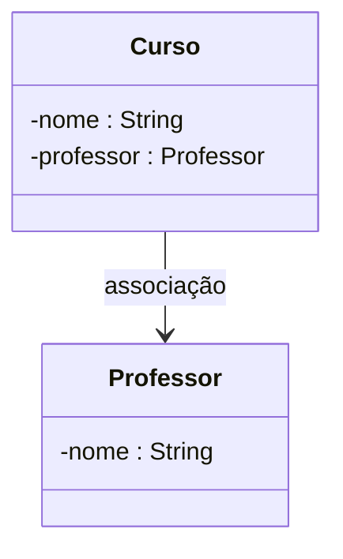
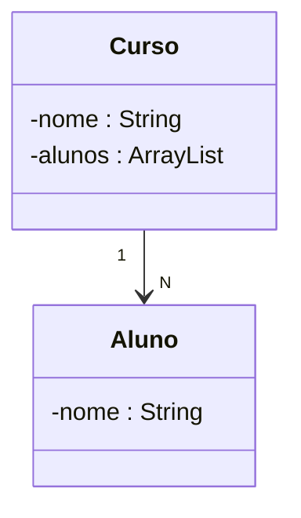
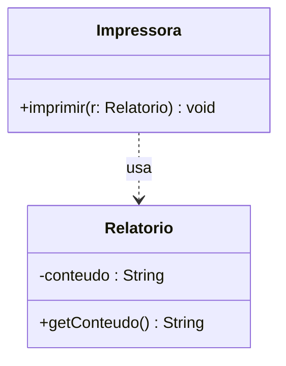
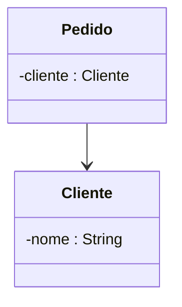

# Unidade 2 – Relacionamentos, Mapeamentos, ArrayList, Dependência, Especialização e Associação

## Aula 09 – Relacionamentos, Mapeamentos, ArrayList, Dependência, Especialização e Associação  
**03/09/2025**

### Relacionamentos entre Classes
Na POO, classes raramente existem isoladas — elas se relacionam para formar sistemas mais complexos.

**Tipos comuns de relacionamento:**
- **Associação** → Uma classe conhece a outra e pode interagir com ela.  
- **Agregação** → Uma classe é composta por outras, mas as partes podem existir separadamente.  
- **Composição** → Uma classe é composta por outras, mas as partes não existem sem o todo.  
- **Dependência** → Uma classe usa outra temporariamente para executar uma tarefa.  
- **Herança (Especialização)** → Uma classe herda atributos e métodos de outra.

**Exemplo de Associação:**
```java
public class Professor {
    String nome;
}

public class Curso {
    String nome;
    Professor professor; // associação
}
```



📌 Resumo: Relacionamentos definem como objetos interagem e colaboram.

### Mapeamentos
Mapeamento é a forma de representar relacionamentos no código e/ou em diagramas UML.

No UML:

Linha simples → Associação

Linha com losango vazio → Agregação

Linha com losango preenchido → Composição


No código Java:

Associação: atributo de outra classe.

Agregação/Composição: atributos de coleção ou instâncias diretas.


### ArrayList

ArrayList é uma implementação de lista dinâmica em Java, que cresce e diminui conforme necessário.

Características:

Permite elementos duplicados.

Mantém a ordem de inserção.

Acesso rápido por índice.

Exemplo:
```java
import java.util.ArrayList;

public class ExemploArrayList {
    public static void main(String[] args) {
        ArrayList<String> nomes = new ArrayList<>();
        nomes.add("Ana");
        nomes.add("Bruno");
        nomes.add("Carla");

        for (String nome : nomes) {
            System.out.println(nome);
        }
    }
}
```
📌 Resumo: Use ArrayList quando precisar de uma coleção flexível e ordenada.

### Relacionamento "maior que 1"
Quando uma classe se relaciona com múltiplas instâncias de outra, usamos coleções como ArrayList.

Exemplo:
```java
import java.util.ArrayList;

public class Curso {
    String nome;
    ArrayList<Aluno> alunos = new ArrayList<>();
}

public class Aluno {
    String nome;
}
```


📌 Resumo: Relacionamentos 1:N ou N:N são representados com coleções.

### Dependência

Ocorre quando uma classe usa outra apenas temporariamente.

Exemplo:
```java
public class Relatorio {
    private String conteudo;
    public Relatorio(String conteudo) {
        this.conteudo = conteudo;
    }
    public String getConteudo() {
        return conteudo;
    }
}

public class Impressora {
    public void imprimir(Relatorio r) {
        System.out.println(r.getConteudo());
    }
}
```


### Associação
É o relacionamento mais genérico, quando uma classe conhece a outra.

Exemplo:
```java
public class Cliente {
    String nome;
}

public class Pedido {
    Cliente cliente; // associação
}
```

📌 Resumo: Associação é a base para outros tipos de relacionamento.

💡 Dica para os alunos: Sempre que modelar um sistema, pergunte "essa classe precisa conhecer a outra?" e "essa relação é temporária ou permanente?" para escolher o tipo de relacionamento correto.