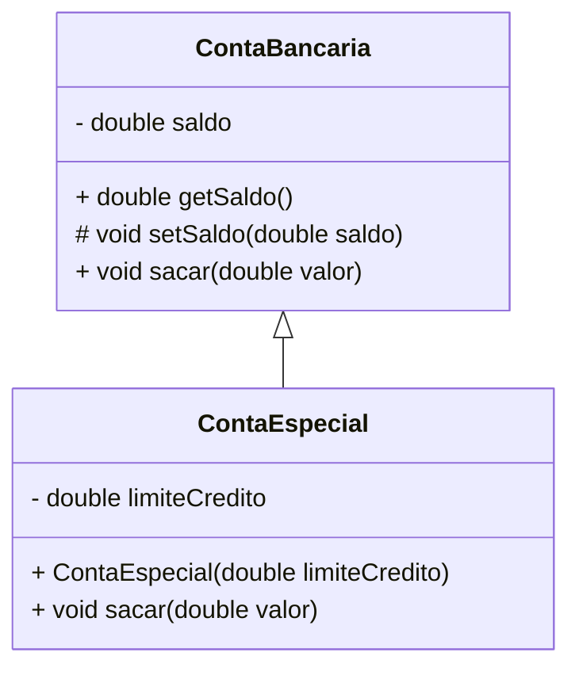

## Unidade 3 – Herança

## 📚 Sumário
- [Aula 14 – Herança](#aula-14--herança)
- [Aula 15 – Generalização e Classes Abstratas](#aula-15--generalização-e-classes-abstratas)


#### Aula 14 – Herança
18/09/2025

## Conceito de Herança
- **Herança** é um relacionamento entre classes onde uma classe (subclasse) **herda atributos e métodos** de outra (superclasse).
- Permite **reutilização de código** e a criação de especializações.

Exemplo simples:
```java
class ContaBancaria {
	private double saldo;

	public double getSaldo() {
		return saldo;
	}

	protected void setSaldo(double saldo) {
		this.saldo = saldo;
    }
	
	protected void setSaldo(double saldo) {
		this.saldo = saldo;
	}

	public void sacar(double valor) {
		if (valor > saldo) {
			throw new IllegalArgumentException("Saldo insuficiênte!");
		}
		saldo -= valor;
	}
}

class ContaEspecial extends ContaBancaria {

	private double limiteCredito;

	public ContaEspecial(double limiteCredito) {
		this.limiteCredito = limiteCredito;
	}

	public void sacar(double valor) {
		if (valor > (getSaldo() + limiteCredito)) {
			throw new IllegalArgumentException("Saldo + limite insuficiênte!");
		}
		setSaldo(getSaldo()-valor);
	}
}
````

---

## Representação em UML

* A **herança** é representada por uma **seta com linha contínua** e ponta fechada apontando para a superclasse.
* Membros **protegidos** são representados com o símbolo `#`.
* Membros **privados** são representados com `-`.

Exemplo em UML:



---

## Superclasse Direta e Indireta

* **Superclasse direta**: a classe que é herdada imediatamente.
* **Superclasse indireta**: classes mais “acima” na hierarquia, herdadas de forma transitiva.

Exemplo:

```java
class Animal { }
class Mamifero extends Animal { } // superclasse direta: Animal
class Cachorro extends Mamifero { } // superclasse direta: Mamifero, indireta: Animal
```

---

## Hierarquia de Classes

* Todas as classes em Java **herdam indiretamente de `Object`**.
* Isso significa que qualquer classe pode utilizar (ou sobrescrever) métodos definidos em `Object`.

Principais métodos de `Object`:

* `toString()` → representação textual do objeto.
* `equals()` → comparação de objetos.

Exemplo:

```java
@Override
public String toString() {
    return "Conta Especial com limite: " + limiteCredito;
}

@Override
public boolean equals(Object obj) {
    if (this == obj) return true;
    if (!(obj instanceof ContaEspecial)) return false;
    ContaEspecial outra = (ContaEspecial) obj;
    return this.limiteCredito == outra.limiteCredito;
}
```

---

## Herança e Modificadores de Acesso

* **private**: acessível apenas dentro da própria classe.
* **protected**: acessível dentro da classe, subclasses e mesmo pacote.
* **public**: acessível de qualquer lugar.

👉 O uso de `protected` é útil para permitir que subclasses manipulem determinados atributos, como no exemplo de `setSaldo()`.

---

## Sobrescrita de Método

* Uma subclasse pode **reescrever** (sobrescrever) o comportamento de um método herdado.
* Deve usar a anotação `@Override` para garantir que a sobrescrita está correta.

Exemplo:

```java
@Override
public String toString() {
    return "Saldo atual: " + getSaldo();
}
```

---

## Herança de Construtores

* Construtores **não são herdados**.
* É necessário **chamar o construtor da superclasse** usando `super(...)`.

Exemplo:

```java
class ContaBancaria {
    private double saldo;

    public ContaBancaria(double saldoInicial) {
        this.saldo = saldoInicial;
    }
}

class ContaEspecial extends ContaBancaria {
    private double limite;

    public ContaEspecial(double saldoInicial, double limite) {
        super(saldoInicial); // chamada ao construtor da superclasse
        this.limite = limite;
    }
}
```
---
#### Aula 15 – Generalização e Classes Abstratas
24/10/2025

### Generalização
- Processo de **identificar atributos e comportamentos comuns** entre várias classes e extrair para uma **superclasse mais genérica**.
- Evita duplicação de código e melhora a organização da hierarquia.

Exemplo:
```java
class Funcionario {
    protected String nome;
    protected double salario;

    public Funcionario(String nome, double salario) {
        this.nome = nome;
        this.salario = salario;
    }

    public void exibirDados() {
        System.out.println("Nome: " + nome + ", Salário: " + salario);
    }
}

class Gerente extends Funcionario {
    private double bonus;

    public Gerente(String nome, double salario, double bonus) {
        super(nome, salario);
        this.bonus = bonus;
    }
}

class Vendedor extends Funcionario {
    private double comissao;

    public Vendedor(String nome, double salario, double comissao) {
        super(nome, salario);
        this.comissao = comissao;
    }
}
````

---

## Classes Abstratas

* Uma **classe abstrata** não pode ser instanciada diretamente.
* Serve como **modelo** para subclasses, que devem herdar e completar sua implementação.
* Pode conter:

    * **Métodos concretos** (implementados).
    * **Métodos abstratos** (sem implementação).

Exemplo:

```java
abstract class Animal {
    protected String nome;

    public Animal(String nome) {
        this.nome = nome;
    }

    // método abstrato - deve ser implementado pelas subclasses
    public abstract void emitirSom();

    // método concreto - já tem implementação
    public void dormir() {
        System.out.println(nome + " está dormindo...");
    }
}

class Cachorro extends Animal {
    public Cachorro(String nome) {
        super(nome);
    }

    @Override
    public void emitirSom() {
        System.out.println("Au Au!");
    }
}
```

---

## Métodos Abstratos

* Definidos apenas com a **assinatura**, sem corpo.
* Obrigam as subclasses a fornecerem uma implementação.

Exemplo:

```java
abstract class Forma {
    public abstract double calcularArea();
}

class Circulo extends Forma {
    private double raio;

    public Circulo(double raio) {
        this.raio = raio;
    }

    @Override
    public double calcularArea() {
        return Math.PI * raio * raio;
    }
}
```

---

## Modificador `final`

* **final em variáveis** → impede reatribuição (constantes).
* **final em métodos** → impede sobrescrita em subclasses.
* **final em classes** → impede herança (não pode ter subclasses).

Exemplo:

```java
class Conta {
    public final void mostrarMensagem() {
        System.out.println("Bem-vindo ao banco!");
    }
}

// Não é possível sobrescrever em uma sublcasse.

final class UtilBanco {
    public static void imprimirAviso() {
        System.out.println("Aviso importante!");
    }
}

// Não é possível estender UtilBanco
// class OutraClasse extends UtilBanco { } // ERRO
```