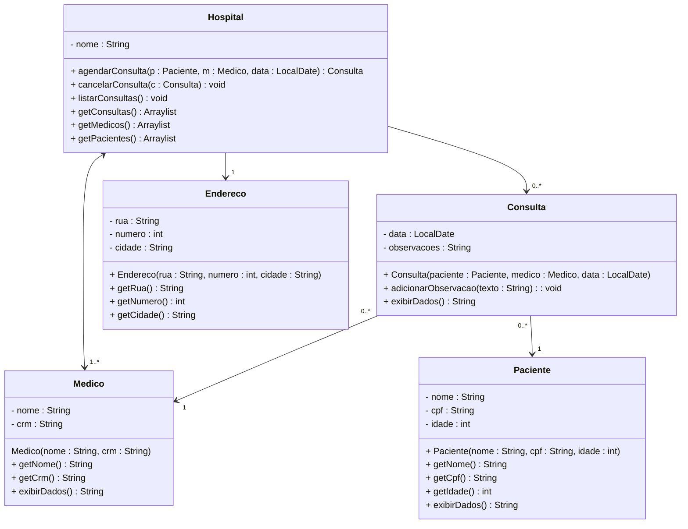

```mermaid
classDiagram
    class Hospital {
      - nome : String
      + agendarConsulta(p : Paciente, m : Medico, data : LocalDate) Consulta
      + cancelarConsulta(c : Consulta) void
      + listarConsultas() void
      + getConsultas() Arraylist<Consulta>
      + getMedicos() Arraylist<Medico>
      + getPacientes() Arraylist<Paciente>
    }

    class Medico {
      - nome : String
      - crm : String
      Medico(nome : String, crm : String)
      + getNome() String
      + getCrm() String
      + exibirDados() String
    }

    class Paciente {
      - nome : String
      - cpf : String
      - idade : int
      + Paciente(nome : String, cpf : String, idade : int)
      + getNome() String
      + getCpf() String
      + getIdade() int
      + exibirDados() String
    }

    class Consulta {
      - data : LocalDate
      - observacoes : String
      + Consulta(paciente : Paciente, medico : Medico, data : LocalDate)
      + adicionarObservacao(texto : String) : void
      + exibirDados() String
    }

    class Endereco {
      - rua : String
      - numero : int
      - cidade : String
      + Endereco(rua : String, numero : int, cidade : String)
      + getRua() String
      + getNumero() int
      + getCidade() String
    }

    Hospital --> "1" Endereco
    Hospital "0..1" <--> "1..*" Medico
    Hospital --> "0..*" Consulta
    Consulta "0..*" --> "1" Paciente
    Consulta "0..*" --> "1" Medico

```