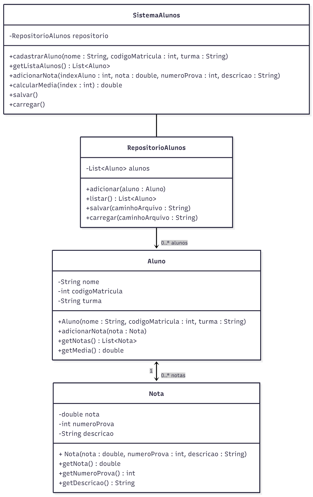

# PROVA 03 – B

Assim que receber a prova leia com muita atenção as observações abaixo.

## ATENÇÃO
- Não é permitido o uso do smartphone durante a aula, nem mesmo para fotografar a prova.
- A prova é individual e sem consulta; respostas iguais serão anuladas.
- Lembre-se que a interpretação do enunciado faz parte da avaliação destas questões.
- A prova deve ser desenvolvida durante o período desta aula, e entregue no máximo até **21:50**.
- Não é permitido utilizar nenhuma plataforma de comunicação durante a prova (e-mail, WhatsApp, Telegram, Discord, etc.). Caso seja identificada a utilização, a nota será zero.

---

# Sistema de Alunos e Registro de Notas

Você deverá implementar parte de um sistema de controle de alunos com suas notas utilizando conceitos de **POO** e **Swing**.

A interface gráfica, o método `main` e parte das classes serão fornecidas sem implementação.  
Seu trabalho será implementar todas as classes de domínio e a lógica interna.

---

## Objetivo Geral do Sistema

Você deve implementar um sistema que permita:

### 1. Cadastrar alunos, contendo:
- Nome
- Código de matrícula
- Turma

### 2. Listar os alunos cadastrados na tabela da interface gráfica.

### 3. Adicionar notas para um aluno selecionado, onde cada nota deve conter:
- Nota obtida
- Número da prova ou trabalho
- Pequena descrição
    - Ex.: “Avaliação Parcial”, “Projeto Prático”, etc.

A inserção dos dados será feita via **JOptionPane**.

### 4. Calcular a média final de um aluno, usando a fórmula:

`média = somarTodasAsNotas / quantidadeDeNotas`

### 5. Persistir todos os dados em arquivo (texto ou binário).
- Ao iniciar, o sistema deve carregar os dados.
- Ao encerrar ou cadastrar algo, deve salvar automaticamente.

---

# Estrutura de Classes Obrigatória

Você deverá implementar e/ou ajustar todas as classes listadas no diagrama:

- `Aluno`
- `Nota`
- `RepositorioAlunos`
- `SistemaAlunos`

---

# Funcionalidades e Pontuações

- Classes – conforme o diagrama (**1,0 ponto**)
- Cadastrar alunos (**1,0 ponto**)
- Inserir notas via JOptionPane para o registro selecionado na tabela (**2,0 pontos**)
- Calcular média para o registro selecionado na tabela (**2,0 pontos**)
- Salvar e carregar de arquivo (**3,0 pontos**)
- Atualizar tabela após alterações (**1,0 ponto**)

---

# Componentes da Interface Gráfica (já fornecida)

A interface terá:

### Parte Superior
- Campos para cadastrar o aluno
- Botão **Adicionar Aluno**

### Parte Central
- Tabela listando alunos

### Parte Inferior
- Botão **Adicionar Nota**
- Botão **Calcular Média**

A interface contém os botões e campos, mas **não possui lógica**.

---

## Você deve implementar:
- Classes obrigatórias
- Interação entre GUI → `SistemaAlunos`
- Manipulação de listas
- Persistência
- Cálculos  

