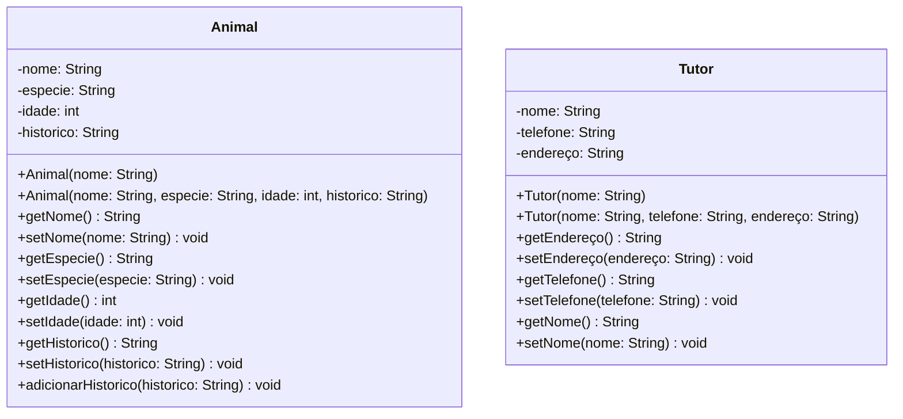

```mermaid
classDiagram
    class Animal {
        -nome: String
        -especie: String
        -idade: int
        -historico: String
        +Animal(nome: String)
        +Animal(nome: String, especie: String, idade: int, historico: String)
        +getNome() String
        +setNome(nome: String) void
        +getEspecie() String
        +setEspecie(especie: String) void
        +getIdade() int
        +setIdade(idade: int) void
        +getHistorico() String
        +setHistorico(historico: String) void
        +adicionarHistorico(historico: String) void
    }

    class Tutor {
        -nome: String
        -telefone: String
        -endereço: String
        +Tutor(nome: String)
        +Tutor(nome: String, telefone: String, endereço: String)
        +getEndereço() String
        +setEndereço(endereço: String) void
        +getTelefone() String
        +setTelefone(telefone: String) void
        +getNome() String
        +setNome(nome: String) void
    }
```