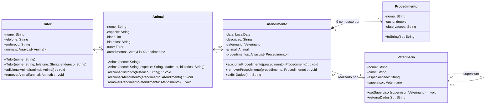

```mermaid
classDiagram
    direction LR

    class Tutor {
        -nome: String
        -telefone: String
        -endereço: String
        -animais: ArrayList~Animal~
        +Tutor(nome: String)
        +Tutor(nome: String, telefone: String, endereço: String)
        +adicionarAnimal(animal: Animal): void
        +removerAnimal(animal: Animal): void
    }

    class Animal {
        -nome: String
        -especie: String
        -idade: int
        -historico: String
        -tutor: Tutor
        -atendimentos: ArrayList~Atendimento~
        +Animal(nome: String)
        +Animal(nome: String, especie: String, idade: int, historico: String)
        +adicionarHistorico(historico: String): void
        +adicionarAtendimento(atendimento: Atendimento): void
        +removerAtendimento(atendimento: Atendimento): void
    }

    class Atendimento {
        -data: LocalDate
        -descricao: String
        -veterinario: Veterinario
        -animal: Animal
        -procedimentos: ArrayList~Procedimento~
        +adicionarProcedimento(procedimento: Procedimento): void
        +removerProcedimento(procedimento: Procedimento): void
        +exibirDados(): String
    }

    class Procedimento {
        -nome: String
        -custo: double
        -observacoes: String
        +toString(): String
    }

    class Veterinario {
        -nome: String
        -crmv: String
        -especialidade: String
        -supervisor: Veterinario
        +setSupervisor(supervisor: Veterinario): void
        +retornaDados(): String
    }

%% Relacionamentos com Direção

%% Um Tutor possui vários Animais (Agregação)
%% Um Animal pertence a um Tutor (Associação Direta)
Tutor "1" <--> "0..*" Animal

%% Um Animal possui vários Atendimentos (Agregação)
%% Um Atendimento pertence a um Animal (Associação Direta)
Animal "1" <--> "0..*" Atendimento

%% Um Atendimento é composto por vários Procedimentos (Composição)
%% A seta preenchida indica que Procedimento não existe sem um Atendimento.
Atendimento "1" *--> "0..*" Procedimento : é composto por

%% Um Atendimento é realizado por um Veterinário (Associação Direta)
Atendimento "0..*" --> "1" Veterinario : realizado por

%% Um Veterinário é supervisionado por outro Veterinário (Auto-relacionamento)
Veterinario "0..*" --> "0..1" Veterinario : supervisor
```